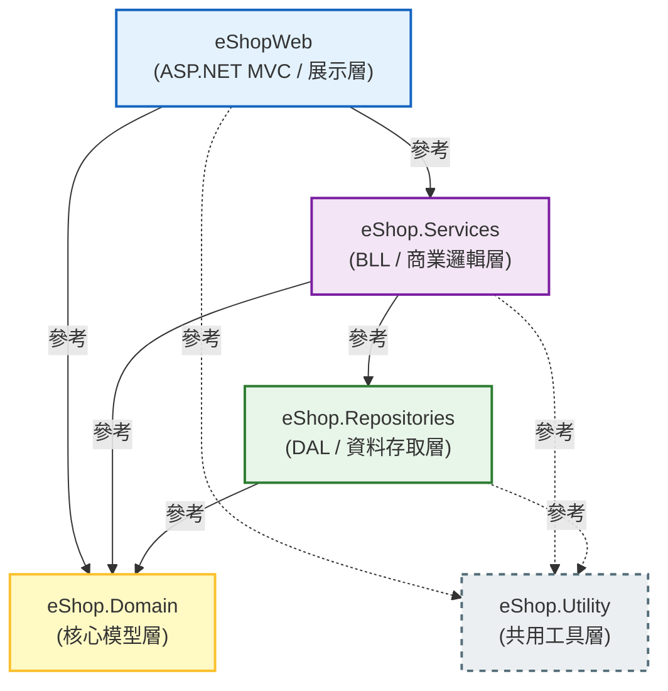

# eShop 方案
eShop 方案是一個基於 ASP.NET MVC 的電子商務網站

## 專案結構
eShop 方案包含以下專案：

## 開發環境

- Windows
- Git Bash
- .NET Framework 4.6.2
- ASP.NET MVC 5
- VS Code
- Visual Studio 2026
- SQL Server
- Entity Framework 6
- Bootstrap v5.2.3
- VanillaJS
- no jQuery
- HTML5 / CSS3
- FluentValidation 11.12.0 at Services layer for validation
- no AutoMapper
- Serilog 4.3.1 at Utility layer for logging
- Serilog.Sinks.File 7.0.0 at Utility layer for file logging
- Serilog.Sinks.MSSqlServer 9.0.3 at Utility layer for SQL Server logging

## 提醒
- 若要新增資料庫， **MUST** 提供 T-SQL 腳本，並且放在 `DatabaseScripts` 資料夾中。
- 每個 Property 都應該有 XML 註解，並且使用 PascalCase 命名。
- 每個方法都應該有 XML 註解，並且使用 PascalCase 命名。
- 每個類別都應該有 XML 註解，並且使用 PascalCase 命名。

## 錯誤處理
全域防線：Global.asax 與 Web.config
作法：
在 eShopWeb 的 Global.asax 檔案中，使用 Application_Error 事件。這是系統的「最後一道防線」，任何沒有被 Try-Catch 抓到的例外都會跑到這裡。 Global.asax 在應用程式啟動時初始化（Log.Logger = new LoggerConfiguration()...）。
在 Web.config 設定 <customErrors mode="On">。
用途： 用來處理 404 (找不到網頁) 或 500 (伺服器錯誤)，並統一導向您設計好的美觀錯誤提示頁面。
並呼叫 Utility 裡的 Serilog 把錯誤寫進檔案，最後透過 Web.config 導向友善的「系統維護中」畫面。