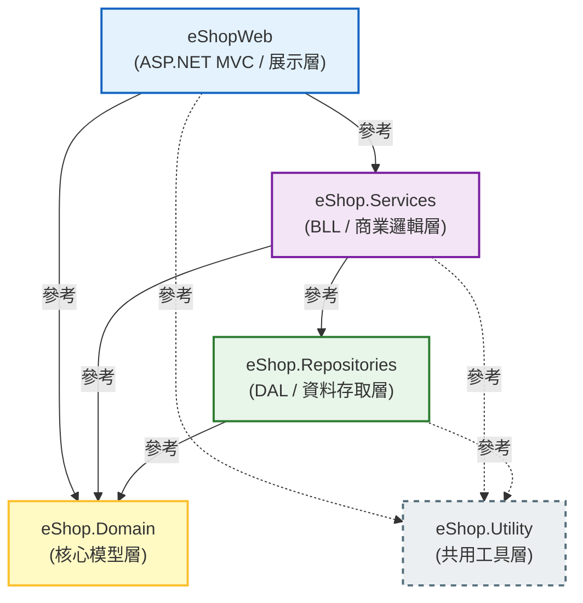

# eShop 方案
eShop 方案是一個基於 ASP.NET MVC 的電子商務網站。

---

## 專案結構



---

## 開發環境

- Windows
- Git Bash
- .NET Framework 4.6.2
- ASP.NET MVC 5
- VS Code
- Visual Studio 2026
- SQL Server
- Entity Framework 6
- no Bootstrap
- VanillaJS
- no jQuery
- HTML5 / CSS3
- FluentValidation 11.12.0 at Services layer for validation
- no AutoMapper
- Serilog 4.3.1 at Utility layer for logging
- Serilog.Sinks.File 7.0.0 at Utility layer for file logging
- Serilog.Sinks.MSSqlServer 9.0.3 at Utility layer for SQL Server logging
- Autofac 5.2.0 + Autofac.Mvc5 5.0.0 at eShopWeb for DI

---

## MVP 原則（最小可行性產品）

- 每次實作以**最小可行功能**為目標，先讓流程跑通，再逐步迭代擴充。
- 不預先過度設計（Over-engineering）：沒有明確需求前，不建立不必要的抽象層或通用框架。
- 優先實作核心業務流程（商品瀏覽、下訂單、會員登入），次要功能（報表、統計）後續迭代。
- 每個功能完成後需可實際執行與驗證，不留半成品進版本控制。

---

## 設計原則

### SOLID

| 原則 | 全名 | 說明 |
|------|------|------|
| **S** | Single Responsibility Principle（單一職責原則） | 每個類別只負責一件事，變更原因只有一個。例如 `ProductService` 只處理商品業務邏輯，不負責 Log 或 Email。 |
| **O** | Open/Closed Principle（開放封閉原則） | 對擴充開放、對修改封閉。新增功能應透過新增類別或實作介面，而不是修改既有程式碼。 |
| **L** | Liskov Substitution Principle（里氏替換原則） | 子類別必須能替換父類別使用，且不破壞程式正確性。介面實作必須完整遵守介面契約。 |
| **I** | Interface Segregation Principle（介面隔離原則） | 介面應細分，避免強迫實作類別依賴不需要的方法。例如拆分 `IReadRepository` 與 `IWriteRepository`。 |
| **D** | Dependency Inversion Principle（依賴反轉原則） | 高層模組不依賴低層模組，兩者都依賴抽象（介面）。本專案透過 Autofac DI 實現，Controller 依賴 `IProductService` 而非 `ProductService`。 |

### Clean Code

- **命名清晰**：變數、方法、類別名稱應能自我說明，避免縮寫或模糊命名（如 `d`、`temp`、`DoStuff()`）。
- **方法短小**：每個方法只做一件事，行數盡量控制在 20 行以內，過長則應拆分。
- **避免魔法數字**：數字與字串常數應抽取為具名常數，例如 `const int MaxPageSize = 50`。
- **不留死碼**：已廢棄的程式碼必須刪除，不以註解方式保留在檔案中。
- **錯誤處理要明確**：例外處理應有意義，不得使用空的 `catch` 區塊吞掉例外。

### DRY（Don't Repeat Yourself）

- 相同邏輯不得重複出現在多處，應抽取為共用方法、基底類別或 Utility 輔助方法。
- 重複的驗證邏輯統一使用 FluentValidation 定義，不在 Controller 與 Service 中各自重複撰寫。
- 重複的資料庫查詢條件應封裝於 Repository 方法中，由 Service 呼叫，禁止跨層複製相同查詢邏輯。

### KISS（Keep It Simple, Stupid）

- 優先選擇簡單直觀的實作，避免過度設計。
- 不引入不必要的設計模式或框架；只在確實解決問題時才使用。
- 程式碼邏輯應讓其他開發者能在短時間內理解，避免聰明但難以維護的寫法。

### YAGNI（You Aren't Gonna Need It）

- 不實作「未來可能需要」的功能，只實作當前需求明確要求的部分。
- 禁止預先建立沒有實際使用者的介面、抽象層或通用框架。
- 若需求尚未確認，暫緩設計；需求明確後再進行對應實作。

---

## 程式碼撰寫規範

- 每個 Property 都應該有 XML 註解，並且使用 PascalCase 命名。
- 每個方法都應該有 XML 註解，並且使用 PascalCase 命名。
- 每個類別都應該有 XML 註解，並且使用 PascalCase 命名。
- Inline comment（行內註解）應該使用 zh-TW，並且簡潔明瞭。
- **每個 `.cs` 檔案只能包含一個 `class`、`enum`、`struct` 或 `interface`**，禁止將多個型別定義在同一個檔案中。
- 此專案為 **.NET Framework** 專案，建置時 **MUST** 使用 `msbuild`，**禁止**使用 `dotnet` CLI 指令（`dotnet build`、`dotnet run` 等均不適用）。
- 若要新增資料庫變更，**MUST** 提供 T-SQL 腳本，並放在 `DatabaseScripts` 資料夾中。

### 如何在 Git Bash 執行 msbuild

**背景說明**：Git Bash 無法直接執行路徑含空格的 Windows 可執行檔（MSBuild 位於 `C:\Program Files\...`），因此需要透過以下設定才能正常使用。

**一次性環境設定**（已完成，毋需重複）：

在 `~/.bash_profile` 新增 alias：

```bash
alias msbuild='MSYS_NO_PATHCONV=1 "/c/Program Files/Microsoft Visual Studio/18/Community/MSBuild/Current/Bin/MSBuild.exe"'
```

`MSYS_NO_PATHCONV=1` 防止 Git Bash 將 `/p:` `/t:` 等 MSBuild 參數誤認為 Unix 路徑並自動轉換。

**建置指令**：

```bash
# 進入專案根目錄
cd /d/VSCodeProject/GitBashWithMsbuildTest/eShop 

# Debug 模式（預設）
bash build.sh

# Release 模式
bash build.sh Release
```

**`build.sh` 說明**：專案根目錄的 [build.sh](build.sh) 封裝了完整的建置邏輯，使用 `#!/bin/bash -l`（登入 shell）確保 `~/.bash_profile` 的 alias 被載入，並以 `/clp:ErrorsOnly` 過濾無關的版本衝突警告，只顯示真正的錯誤。

**最新建置結果**：

```
=== eShop msbuild 開始 (Configuration: Debug) ===
.NET Framework 的 MSBuild 版本 18.3.0-release-26070-10+3972042b7
=== 建置成功 ===
```

0 個錯誤，輸出：`eShopWeb\bin\eShopWeb.dll`

---

## SpecKit 相關規範

- We're going to be using slash command from `.github\\prompts\\` with VS Code
- We're going to be using slash command from `.github\\skills\\` with github copilot cli
- **所有由 SpecKit 產生的文件（spec、plan、checklist 等）一律使用 zh-TW 台灣用語撰寫**，確保甲方、SA、PM、PG 均能直接閱讀與理解業務需求。
- 技術術語若無對應的慣用中文譯名（例如：Repository、ViewModel、Entity），可保留英文原文，但說明文字必須以中文補充。
- 禁止使用中國大陸用語（如「组件」應改為「元件」、「获取」應改為「取得」、「实现」應改為「實作」）。

---

## OpenSpec 相關規範

- **所有由 OpenSpec 產生的文件一律使用 zh-TW 台灣用語撰寫**，確保甲方、SA、PM、PG 均能直接閱讀與理解業務需求。
- 技術術語若無對應的慣用中文譯名，可保留英文原文，但說明文字必須以中文補充。
- 禁止使用中國大陸用語（如「组件」應改為「元件」、「获取」應改為「取得」、「实现」應改為「實作」）。

---

## 版本控制規範

- **完成一個完整功能後，必須先執行 `msbuild` 確認建置成功，才可 `git commit`**，禁止在建置失敗的狀態下提交。
- **每個 commit 只包含一個完整功能**，避免單一 commit 夾帶過多變更，造成 code review 困難。
- commit message 使用中文，格式為 `類型: 簡短說明`，例如：
  - `feat: 新增商品列表頁面`
  - `fix: 修正商品價格顯示錯誤`
  - `refactor: 重構 ProductService 查詢邏輯`
  - `chore: 新增 V001_CreateProductTable.sql 資料庫腳本`
- 禁止使用 `git add .` 一次加入所有檔案；應明確指定與本次功能相關的檔案，確保 commit 內容聚焦。
- 半成品、未通過建置的程式碼，**禁止 commit 進版本控制**。

---

## 錯誤處理

全域防線：`Global.asax` 與 `Web.config`

- 在 `eShopWeb` 的 `Global.asax` 中使用 `Application_Error` 事件作為系統「最後一道防線」，任何未被 try-catch 攔截的例外都會到這裡。
- `Global.asax` 在應用程式啟動時初始化 Serilog（`Log.Logger = new LoggerConfiguration()...`）。
- 在 `Web.config` 設定 `<customErrors mode="On">`，統一導向錯誤頁面。
- 用途：處理 404（找不到頁面）或 500（伺服器錯誤），呼叫 Utility 層的 Serilog 寫入 Log，再透過 `Web.config` 導向友善的錯誤提示頁面。

---

## 命名慣例
| 類型 | 規則 | 範例 |
|------|------|------|
| 類別、介面、方法、屬性、列舉 | PascalCase | `ProductService`, `GetById()` |
| 介面 | 前綴 `I` | `IProductService`, `IProductRepository` |
| 私有欄位 | 前綴 `_` + camelCase | `_productRepository` |
| 區域變數、參數 | camelCase | `productId`, `userName` |
| 常數 | PascalCase | `MaxPageSize`, `DefaultPageIndex` |
| ViewModel | 後綴 `ViewModel` | `ProductListViewModel`, `CartViewModel` |
| DTO（跨層傳輸） | 後綴 `Dto` | `ProductDto`, `OrderDto` |
| FluentValidation 驗證器 | 後綴 `Validator` | `CreateProductValidator` |

---

## 分層職責
每一層只能做自己職責範圍內的事，嚴禁跨層直接呼叫。

| 層 | 職責 | 禁止事項 |
|----|------|----------|
| **eShopWeb（展示層）** | 處理 HTTP 請求/回應、ViewModel 組裝、驗證 ModelState | 不得直接存取 Repository 或 DbContext |
| **eShop.Services（商業邏輯層）** | 商業規則、FluentValidation 驗證、協調 Repository | 不得直接參考 HttpContext |
| **eShop.Repositories（資料存取層）** | Entity Framework 存取、CRUD 操作 | 不得包含商業邏輯 |
| **eShop.Domain（核心模型層）** | Entity 類別、Enum、共用介面 | 不得參考其他專案層 |
| **eShop.Utility（共用工具層）** | Serilog 封裝、通用輔助方法 | 不得參考 Services / Repositories |

---

## 服務層回傳值規範
- Service 方法 **MUST** 回傳 `ServiceResult<T>` 或 `ServiceResult`，而非直接拋出例外到展示層。
- `ServiceResult` 包含 `bool IsSuccess`、`string Message`、`T Data`（泛型版本）三個屬性。
- Repository 層可拋出例外，Service 層負責 try-catch 並轉為 `ServiceResult`。
- Controller 依據 `IsSuccess` 決定顯示成功訊息或錯誤訊息，不直接 catch Service 的例外。

---

## Entity Framework 6 規範
- 採用 **Database First**：先設計資料庫，再由 EF6 反向工程產生 Entity 類別與 `DbContext`。
- `DbContext` 放在 `eShop.Repositories` 專案中。
- Entity 類別放在 `eShop.Domain` 專案中，**不得**包含 EF 導覽屬性以外的商業邏輯。
- 所有資料庫變更 **MUST** 提供對應的 T-SQL 腳本放在 `DatabaseScripts` 資料夾，並使用版號命名，例如 `V001_CreateProductTable.sql`。
- 連線字串統一放在 `eShopWeb/Web.config` 的 `<connectionStrings>` 區段，其他專案透過傳入方式取得，不得各自硬編碼。

---

## 資料庫規範
- 資料表名稱：複數、PascalCase，例如 `Products`、`Orders`、`OrderItems`。
- 主鍵：`Id`（int IDENTITY）或 `{Table}Id`，例如 `ProductId`。
- 外鍵：`{ReferencedTable}Id`，例如 `CategoryId`、`OrderId`。
- 時間欄位：`CreatedAt`（建立時間）、`UpdatedAt`（最後更新時間），型別使用 `DATETIME2`。
- 軟刪除欄位：`IsDeleted BIT NOT NULL DEFAULT 0`，不得直接 `DELETE` 資料列（除非有特殊需求）。

---

## 安全性規範
- 所有 POST 表單 **MUST** 加上 `@Html.AntiForgeryToken()` 與 `[ValidateAntiForgeryToken]`。
- 需登入才能存取的 Controller 或 Action **MUST** 加上 `[Authorize]`。
- 禁止在 View 中直接輸出未經編碼的使用者輸入（務必使用 `@Html.Encode()` 或 Razor 預設的 HTML 編碼）。
- **絕對禁止**使用 `@Html.Raw()`，所有輸出一律透過 Razor 預設的 HTML 編碼或 `@Html.Encode()`。
- **絕對禁止**在 JavaScript 中使用 `innerHTML`，改用 `textContent` 或 DOM 操作方法（`createElement`、`appendChild` 等）防範 XSS。

---

## 相依性注入（DI）
ASP.NET MVC 5 內建不支援 DI Container，採用以下方式：
- 使用 **建構子注入（Constructor Injection）**，禁止使用 Service Locator 反模式。
- DI 容器使用 **Autofac**，安裝套件：`Autofac`、`Autofac.Mvc5`，僅安裝於 **eShopWeb** 專案。
- DI 設定統一放在 `eShopWeb/App_Start/AutofacConfig.cs`，並在 `Global.asax` 的 `Application_Start` 中呼叫。
- 介面定義於 `eShop.Domain` 或各層內部，實作於對應層，組裝（註冊）於 `AutofacConfig.cs`。
- 其他專案（Services、Repositories）不需安裝 Autofac，僅依賴介面與建構子注入。

---

## 前端規範
- **禁止使用 jQuery**，一律使用 VanillaJS（`document.querySelector`、`fetch` API 等）。
- **絕對禁止**使用 `innerHTML`，改用 `textContent` 或 DOM 建構方法（`createElement`、`appendChild` 等）。
- CSS 樣式優先使用 **Bootstrap 5.2.3** 內建 class，避免自訂 CSS 覆蓋 Bootstrap 預設樣式。
- 自訂 CSS 統一放在 `Content/site.css`，自訂 JS 統一放在 `Scripts/site.js`。
- AJAX 請求使用原生 `fetch` API，回傳格式統一為 JSON。
- 頁面互動驗證可搭配 HTML5 原生驗證屬性（`required`、`minlength` 等），複雜驗證邏輯以 JS 實作。

---

## ViewModel 規範
- Controller **MUST** 使用 ViewModel 與 View 溝通，禁止將 Domain Entity 直接傳入 View。
- ViewModel 放在 `eShopWeb/Models/` 資料夾，依功能分子資料夾，例如 `Models/Product/`、`Models/Order/`。
- ViewModel 不包含商業邏輯，僅作資料傳遞用途。
- 表單驗證**統一使用 FluentValidation**（位於 `eShop.Services` 層），ViewModel **不使用** DataAnnotations 驗證屬性（`[Required]`、`[StringLength]` 等）。
- Controller 將驗證錯誤從 `ServiceResult` 轉寫入 `ModelState`，再回傳 View 顯示。

---

## 會員角色規範
系統共定義四種角色，統一以 `enum` 定義於 `eShop.Domain` 專案中。

| 角色 | 說明 | 權限範圍 |
|------|------|----------|
| **Member**（一般會員） | 完成註冊的一般使用者 | 瀏覽商品、下訂單、管理個人資料 |
| **VipMember**（VIP 會員） | 具有 VIP 資格的會員 | 同一般會員，另享有 VIP 專屬折扣與功能 |
| **Admin**（一般管理員） | 後台操作人員 | 管理商品、訂單、一般會員資料 |
| **SuperAdmin**（最高管理員） | 系統最高權限 | 包含所有功能，另可管理管理員帳號與系統設定 |

- 角色名稱（字串）使用英文，與 `[Authorize(Roles = "...")]` 對應。
- 禁止在程式中 hardcode 角色字串，統一透過常數類別或 `enum.ToString()` 取得。