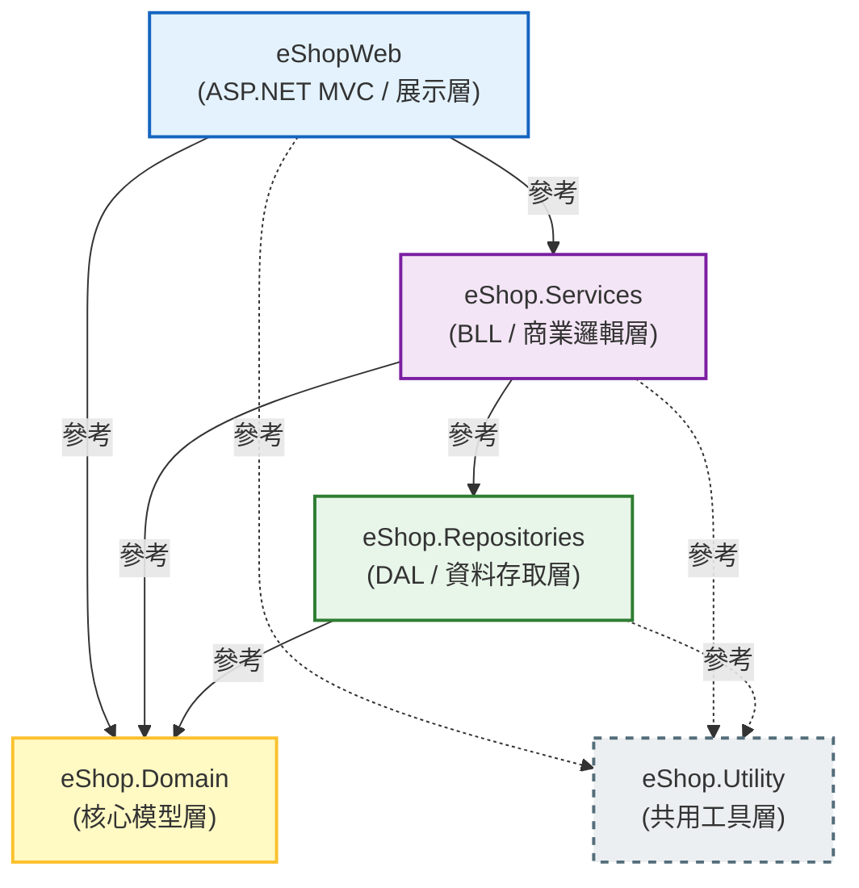

# eShop 方案
eShop 方案是一個基於 ASP.NET MVC 的電子商務網站

## 專案結構
eShop 方案包含以下專案：

## 開發環境

- Windows
- Git Bash
- .NET Framework 4.6.2
- ASP.NET MVC 5
- VS Code
- Visual Studio 2026
- SQL Server
- Entity Framework 6
- Bootstrap v5.2.3
- VanillaJS
- no jQuery
- HTML5 / CSS3
- FluentValidation 11.12.0 at Services layer for validation
- no AutoMapper
- Serilog 4.3.1 at Utility layer for logging
- Serilog.Sinks.File 7.0.0 at Utility layer for file logging
- Serilog.Sinks.MSSqlServer 9.0.3 at Utility layer for SQL Server logging
- Autofac 9.0 + Autofac.Mvc5 6.10 at eShopWeb for DI

## 提醒
- 若要新增資料庫， **MUST** 提供 T-SQL 腳本，並且放在 `DatabaseScripts` 資料夾中。
- 每個 Property 都應該有 XML 註解，並且使用 PascalCase 命名。
- 每個方法都應該有 XML 註解，並且使用 PascalCase 命名。
- 每個類別都應該有 XML 註解，並且使用 PascalCase 命名。

## 錯誤處理
全域防線：Global.asax 與 Web.config
作法：
在 eShopWeb 的 Global.asax 檔案中，使用 Application_Error 事件。這是系統的「最後一道防線」，任何沒有被 Try-Catch 抓到的例外都會跑到這裡。 Global.asax 在應用程式啟動時初始化（Log.Logger = new LoggerConfiguration()...）。
在 Web.config 設定 <customErrors mode="On">。
用途： 用來處理 404 (找不到網頁) 或 500 (伺服器錯誤)，並統一導向您設計好的美觀錯誤提示頁面。
並呼叫 Utility 裡的 Serilog 把錯誤寫進檔案，最後透過 Web.config 導向友善的「系統維護中」畫面。

## 命名慣例
| 類型 | 規則 | 範例 |
|------|------|------|
| 類別、介面、方法、屬性、列舉 | PascalCase | `ProductService`, `GetById()` |
| 介面 | 前綴 `I` | `IProductService`, `IProductRepository` |
| 私有欄位 | 前綴 `_` + camelCase | `_productRepository` |
| 區域變數、參數 | camelCase | `productId`, `userName` |
| 常數 | PascalCase | `MaxPageSize`, `DefaultPageIndex` |
| ViewModel | 後綴 `ViewModel` | `ProductListViewModel`, `CartViewModel` |
| DTO（跨層傳輸） | 後綴 `Dto` | `ProductDto`, `OrderDto` |
| FluentValidation 驗證器 | 後綴 `Validator` | `CreateProductValidator` |

## 分層職責
每一層只能做自己職責範圍內的事，嚴禁跨層直接呼叫。

| 層 | 職責 | 禁止事項 |
|----|------|----------|
| **eShopWeb（展示層）** | 處理 HTTP 請求/回應、ViewModel 組裝、驗證 ModelState | 不得直接存取 Repository 或 DbContext |
| **eShop.Services（商業邏輯層）** | 商業規則、FluentValidation 驗證、協調 Repository | 不得直接參考 HttpContext |
| **eShop.Repositories（資料存取層）** | Entity Framework 存取、CRUD 操作 | 不得包含商業邏輯 |
| **eShop.Domain（核心模型層）** | Entity 類別、Enum、共用介面 | 不得參考其他專案層 |
| **eShop.Utility（共用工具層）** | Serilog 封裝、通用輔助方法 | 不得參考 Services / Repositories |

## 服務層回傳值規範
- Service 方法 **MUST** 回傳 `ServiceResult<T>` 或 `ServiceResult`，而非直接拋出例外到展示層。
- `ServiceResult` 包含 `bool IsSuccess`、`string Message`、`T Data`（泛型版本）三個屬性。
- Repository 層可拋出例外，Service 層負責 try-catch 並轉為 `ServiceResult`。
- Controller 依據 `IsSuccess` 決定顯示成功訊息或錯誤訊息，不直接 catch Service 的例外。

## Entity Framework 6 規範
- 採用 **Database First**：先設計資料庫，再由 EF6 反向工程產生 Entity 類別與 `DbContext`。
- `DbContext` 放在 `eShop.Repositories` 專案中。
- Entity 類別放在 `eShop.Domain` 專案中，**不得**包含 EF 導覽屬性以外的商業邏輯。
- 所有資料庫變更 **MUST** 提供對應的 T-SQL 腳本放在 `DatabaseScripts` 資料夾，並使用版號命名，例如 `V001_CreateProductTable.sql`。
- 連線字串統一放在 `eShopWeb/Web.config` 的 `<connectionStrings>` 區段，其他專案透過傳入方式取得，不得各自硬編碼。

## 資料庫規範
- 資料表名稱：複數、PascalCase，例如 `Products`、`Orders`、`OrderItems`。
- 主鍵：`Id`（int IDENTITY）或 `{Table}Id`，例如 `ProductId`。
- 外鍵：`{ReferencedTable}Id`，例如 `CategoryId`、`OrderId`。
- 時間欄位：`CreatedAt`（建立時間）、`UpdatedAt`（最後更新時間），型別使用 `DATETIME2`。
- 軟刪除欄位：`IsDeleted BIT NOT NULL DEFAULT 0`，不得直接 `DELETE` 資料列（除非有特殊需求）。

## 安全性規範
- 所有 POST 表單 **MUST** 加上 `@Html.AntiForgeryToken()` 與 `[ValidateAntiForgeryToken]`。
- 需登入才能存取的 Controller 或 Action **MUST** 加上 `[Authorize]`。
- 禁止在 View 中直接輸出未經編碼的使用者輸入（務必使用 `@Html.Encode()` 或 Razor 預設的 HTML 編碼）。

## 相依性注入（DI）
ASP.NET MVC 5 內建不支援 DI Container，採用以下方式：
- 使用 **建構子注入（Constructor Injection）**，禁止使用 Service Locator 反模式。
- DI 容器使用 **Autofac**，安裝套件：`Autofac`、`Autofac.Mvc5`，僅安裝於 **eShopWeb** 專案。
- DI 設定統一放在 `eShopWeb/App_Start/AutofacConfig.cs`，並在 `Global.asax` 的 `Application_Start` 中呼叫。
- 介面定義於 `eShop.Domain` 或各層內部，實作於對應層，組裝（註冊）於 `AutofacConfig.cs`。

## 前端規範
- **禁止使用 jQuery**，一律使用 VanillaJS（`document.querySelector`、`fetch API` 等）。
- CSS 樣式優先使用 **Bootstrap 5.2.3** 內建 class，避免自訂 CSS 蓋過 Bootstrap 預設樣式。
- 自訂 CSS 統一放在 `Content/site.css`，自訂 JS 統一放在 `Scripts/site.js`。
- AJAX 請求使用原生 `fetch` API，回傳格式統一為 JSON。
- 頁面互動驗證可搭配 HTML5 原生驗證屬性（`required`、`minlength` 等），複雜驗證邏輯以 JS 實作。

## ViewModel 規範
- Controller **MUST** 使用 ViewModel 與 View 溝通，禁止將 Domain Entity 直接傳入 View。
- ViewModel 放在 `eShopWeb/Models/` 資料夾，依功能分子資料夾，例如 `Models/Product/`、`Models/Order/`。
- ViewModel 不包含商業邏輯，僅作資料傳遞用途。
- 表單驗證**統一使用 FluentValidation**（位於 `eShop.Services` 層），ViewModel **不使用** DataAnnotations 驗證屬性（`[Required]`、`[StringLength]` 等）。
- Controller 將驗證錯誤從 `ServiceResult` 轉寫入 `ModelState`，再回傳 View 顯示。

## 會員角色規範
系統共定義四種角色，統一以 `enum` 定義於 `eShop.Domain` 專案中。

| 角色 | 說明 | 權限範圍 |
|------|------|----------|
| **Member**（一般會員） | 完成註冊的一般使用者 | 瀏覽商品、下訂單、管理個人資料 |
| **VipMember**（VIP 會員） | 具有 VIP 資格的會員 | 同一般會員，另享有 VIP 專屬折扣與功能 |
| **Admin**（一般管理員） | 後台操作人員 | 管理商品、訂單、一般會員資料 |
| **SuperAdmin**（最高管理員） | 系統最高權限 | 包含所有功能，另可管理管理員帳號與系統設定 |

- 角色名稱（字串）使用英文，與 `[Authorize(Roles = "...")]` 對應。
- 禁止在程式中 hardcode 角色字串，統一透過常數類別或 `enum.ToString()` 取得。